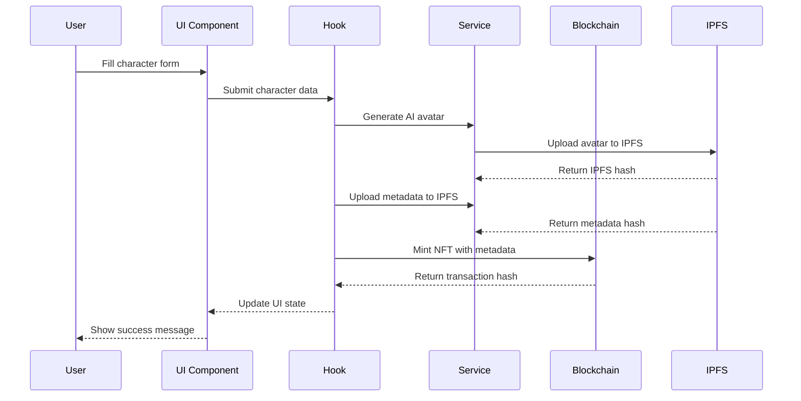
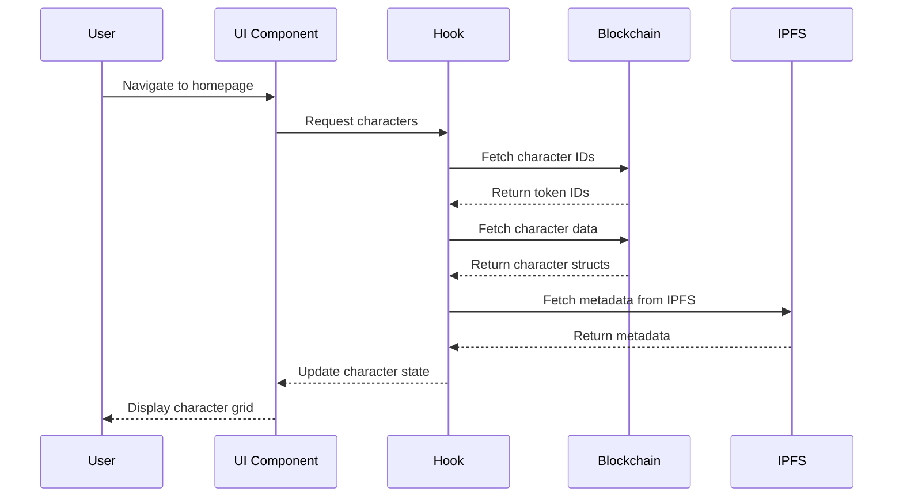
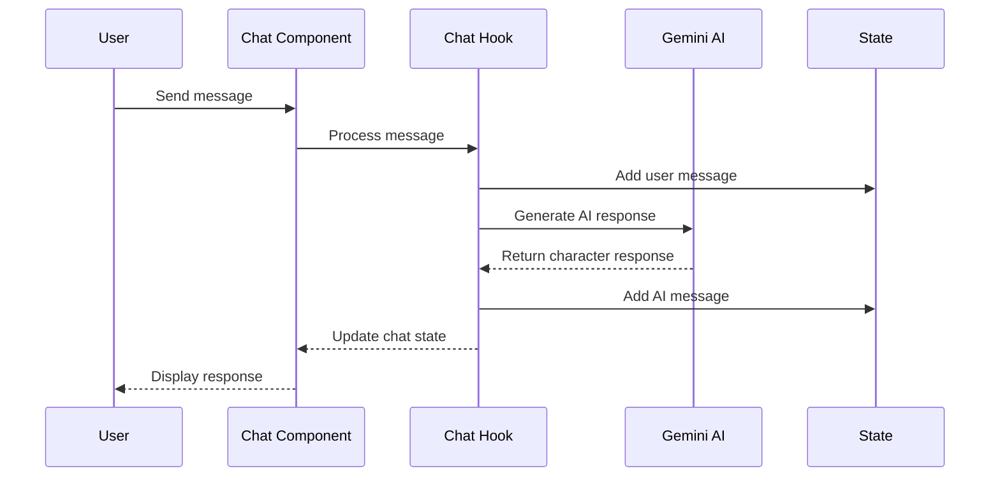

# 🏗️ NFT Chat - Technical Architecture

> **Comprehensive technical architecture and system design documentation**

## 📋 Table of Contents

- [System Overview](#system-overview)
- [Architecture Patterns](#architecture-patterns)
- [Data Flow](#data-flow)
- [Component Architecture](#component-architecture)
- [State Management](#state-management)
- [API Design](#api-design)
- [Smart Contract Architecture](#smart-contract-architecture)
- [Security Considerations](#security-considerations)
- [Performance Optimization](#performance-optimization)
- [Scalability](#scalability)

## 🌐 System Overview

### High-Level Architecture

```
┌─────────────────────────────────────────────────────────────────┐
│                        User Interface                           │
│  ┌─────────────┐  ┌─────────────┐  ┌─────────────────────────┐ │
│  │   Homepage  │  │ Chat Page  │  │   Character Creation    │ │
│  │             │  │             │  │                         │ │
│  └─────────────┘  └─────────────┘  └─────────────────────────┘ │
└─────────────────────────────────────────────────────────────────┘
                                │
                                ▼
┌─────────────────────────────────────────────────────────────────┐
│                    Application Layer                            │
│  ┌─────────────┐  ┌─────────────┐  ┌─────────────────────────┐ │
│  │ React Hooks │  │ Components │  │     State Management    │ │
│  │             │  │             │  │                         │ │
│  └─────────────┘  └─────────────┘  └─────────────────────────┘ │
└─────────────────────────────────────────────────────────────────┘
                                │
                                ▼
┌─────────────────────────────────────────────────────────────────┐
│                     Service Layer                              │
│  ┌─────────────┐  ┌─────────────┐  ┌─────────────────────────┐ │
│  │   Web3      │  │     AI      │  │         IPFS            │ │
│  │  Services   │  │  Services   │  │      Services           │ │
│  └─────────────┘  └─────────────┘  └─────────────────────────┘ │
└─────────────────────────────────────────────────────────────────┘
                                │
                                ▼
┌─────────────────────────────────────────────────────────────────┐
│                    External Services                            │
│  ┌─────────────┐  ┌─────────────┐  ┌─────────────────────────┐ │
│  │  Avalanche  │  │   Gemini    │  │         IPFS            │ │
│  │  Blockchain │  │      AI     │  │      Network            │ │
│  └─────────────┘  └─────────────┘  └─────────────────────────┘ │
└─────────────────────────────────────────────────────────────────┘
```

### Technology Stack Layers

| Layer | Technology | Purpose |
|-------|------------|---------|
| **Presentation** | React 18 + TypeScript | User interface and interactions |
| **State Management** | React Hooks + Context | Application state and data flow |
| **Build System** | Vite + SWC | Fast development and building |
| **Styling** | Tailwind CSS + shadcn/ui | Modern, responsive design |
| **Web3 Integration** | Ethers.js | Blockchain interactions |
| **AI Services** | Google Gemini API | Character conversations |
| **Storage** | IPFS + Pinata | Decentralized file storage |
| **Blockchain** | Avalanche C-Chain | NFT minting and ownership |

## 🏛️ Architecture Patterns

### 1. **Component-Based Architecture**

The application follows React's component-based architecture with clear separation of concerns:

```typescript
// Component Hierarchy
App
├── Router
│   ├── Index (Homepage)
│   │   ├── Header
│   │   ├── Hero Section
│   │   ├── Character Grid
│   │   ├── Create Character Dialog
│   │   └── Footer
│   └── Chat
│       ├── Chat Header
│       ├── Message List
│       ├── Message Input
│       └── AI Status
└── Global Components
    ├── WalletConnect
    ├── Toast Notifications
    └── Loading States
```

### 2. **Custom Hooks Pattern**

Business logic is encapsulated in custom React hooks:

```typescript
// Hook Architecture
useWeb3()           // Wallet management
├── connectWallet()
├── disconnectWallet()
└── wallet state

useNFTContract()    // Smart contract interactions
├── createCharacter()
├── getCharacter()
└── contract state

useCharacters()     // Character data management
├── fetchCharacters()
├── filterCharacters()
└── character state

useChat()          // Chat functionality
├── sendMessage()
├── generateAIResponse()
└── chat state
```

### 3. **Service Layer Pattern**

External integrations are abstracted through service layers:

```typescript
// Service Architecture
Web3Service
├── connectWallet()
├── signTransaction()
└── getProvider()

AIService
├── generateResponse()
├── validateAPIKey()
└── handleErrors()

IPFSService
├── uploadImage()
├── uploadMetadata()
└── getGateway()
```

## 🔄 Data Flow

### 1. **Character Creation Flow**



### 2. **Character Loading Flow**



### 3. **Chat Interaction Flow**



## 🧩 Component Architecture

### 1. **Core Components**

#### `WalletConnect.tsx`
```typescript
interface WalletConnectProps {
  onConnect?: (address: string) => void;
  onDisconnect?: () => void;
}

const WalletConnect: React.FC<WalletConnectProps> = ({
  onConnect,
  onDisconnect
}) => {
  // Wallet connection logic
  // Provider detection (Core Wallet, MetaMask)
  // Account management
  // Network validation
};
```

#### `CharacterCard.tsx`
```typescript
interface CharacterCardProps {
  character: Character;
  onChat: (characterId: string) => void;
  isPrivate?: boolean;
}

const CharacterCard: React.FC<CharacterCardProps> = ({
  character,
  onChat,
  isPrivate = false
}) => {
  // Character display logic
  // Image handling with fallbacks
  // Badge rendering (Public/Private)
  // Action buttons
};
```

### 2. **Page Components**

#### `Index.tsx` (Homepage)
```typescript
const Index: React.FC = () => {
  // State management
  const [characters, setCharacters] = useState<Character[]>([]);
  const [loading, setLoading] = useState(true);
  const [isCreateDialogOpen, setIsCreateDialogOpen] = useState(false);

  // Character creation dialog
  // Character grid rendering
  // Tab management (Public/Private)
  // Search and filtering
};
```

#### `Chat.tsx` (Chat Interface)
```typescript
const Chat: React.FC = () => {
  // Chat state management
  const [messages, setMessages] = useState<Message[]>([]);
  const [isLoading, setIsLoading] = useState(false);

  // Message handling
  // AI response generation
  // Real-time updates
  // Auto-scrolling
};
```

### 3. **Dialog Components**

#### `CreateCharacterDialog.tsx`
```typescript
interface CreateCharacterDialogProps {
  open: boolean;
  onOpenChange: (open: boolean) => void;
  onSuccess?: (character: Character) => void;
}

const CreateCharacterDialog: React.FC<CreateCharacterDialogProps> = ({
  open,
  onOpenChange,
  onSuccess
}) => {
  // Form state management
  // Image selection (AI vs Custom)
  // Form validation
  // Submission handling
};
```

## 📊 State Management

### 1. **Local State (useState)**

```typescript
// Component-level state
const [newMessage, setNewMessage] = useState("");
const [isLoading, setIsLoading] = useState(false);
const [selectedCharacter, setSelectedCharacter] = useState<Character | null>(null);
```

### 2. **Shared State (useContext)**

```typescript
// Global application state
interface AppContextType {
  wallet: WalletState;
  characters: CharacterState;
  notifications: NotificationState;
}

const AppContext = createContext<AppContextType | undefined>(undefined);
```

### 3. **Persistent State (localStorage)**

```typescript
// User preferences and settings
const useLocalStorage = <T>(key: string, initialValue: T) => {
  const [storedValue, setStoredValue] = useState<T>(() => {
    try {
      const item = window.localStorage.getItem(key);
      return item ? JSON.parse(item) : initialValue;
    } catch (error) {
      return initialValue;
    }
  });

  const setValue = (value: T | ((val: T) => T)) => {
    try {
      const valueToStore = value instanceof Function ? value(storedValue) : value;
      setStoredValue(valueToStore);
      window.localStorage.setItem(key, JSON.stringify(valueToStore));
    } catch (error) {
      console.error(error);
    }
  };

  return [storedValue, setValue] as const;
};
```

### 4. **State Synchronization**

```typescript
// Real-time state updates
useEffect(() => {
  const interval = setInterval(() => {
    // Sync with blockchain
    syncCharacterData();
    // Update chat status
    updateChatStatus();
  }, 30000); // Every 30 seconds

  return () => clearInterval(interval);
}, []);
```

## 🔌 API Design

### 1. **Smart Contract Interface**

```solidity
// Core NFT contract interface
interface IChatNFT {
    function createCharacter(
        string memory name,
        string memory description,
        string memory personality,
        string memory avatarUrl,
        string memory tokenURI,
        bool isPublic
    ) external returns (uint256 tokenId);
    
    function getCharacter(uint256 tokenId) 
        external view returns (Character memory);
    
    function getPublicCharacters() 
        external view returns (uint256[] memory);
    
    function transferCharacter(uint256 tokenId, address to) 
        external;
}
```

### 2. **AI Service Interface**

```typescript
interface AIService {
  generateResponse(
    character: Character,
    userMessage: string,
    context?: Message[]
  ): Promise<string>;
  
  validateAPIKey(apiKey: string): Promise<boolean>;
  
  getModelInfo(): Promise<ModelInfo>;
}

interface ModelInfo {
  name: string;
  version: string;
  capabilities: string[];
  rateLimits: RateLimit;
}
```

### 3. **IPFS Service Interface**

```typescript
interface IPFSService {
  uploadImage(imageData: string | File): Promise<string>;
  
  uploadMetadata(metadata: CharacterMetadata): Promise<string>;
  
  getGateway(): string;
  
  validateHash(hash: string): boolean;
}
```

## ⛓️ Smart Contract Architecture

### 1. **Contract Structure**

```solidity
// SPDX-License-Identifier: MIT
pragma solidity ^0.8.19;

contract ChatNFT is ERC721, Ownable {
    // Character data structure
    struct Character {
        string name;
        string description;
        string personality;
        string avatarUrl;
        string tokenURI;
        bool isPublic;
        address creator;
        uint256 createdAt;
    }
    
    // State variables
    mapping(uint256 => Character) public characters;
    mapping(address => uint256[]) public userCharacters;
    uint256[] public publicCharacters;
    
    // Events
    event CharacterCreated(
        uint256 indexed tokenId,
        string name,
        address indexed creator,
        bool isPublic
    );
    
    // Core functions
    function createCharacter(...) external returns (uint256);
    function getCharacter(uint256) external view returns (Character);
    function getPublicCharacters() external view returns (uint256[]);
}
```

### 2. **Gas Optimization**

```solidity
// Gas-efficient storage patterns
contract ChatNFT {
    // Pack related data into single storage slot
    struct CharacterData {
        uint128 createdAt;    // Timestamp
        uint64 tokenId;       // Token ID
        bool isPublic;        // Public flag
        address creator;      // Creator address
    }
    
    // Use events for off-chain data
    event CharacterMetadata(
        uint256 indexed tokenId,
        string name,
        string description,
        string personality,
        string avatarUrl,
        string tokenURI
    );
}
```

### 3. **Access Control**

```solidity
// Role-based access control
contract ChatNFT {
    mapping(address => bool) public moderators;
    mapping(address => bool) public creators;
    
    modifier onlyModerator() {
        require(moderators[msg.sender], "Not a moderator");
        _;
    }
    
    modifier onlyCreator() {
        require(creators[msg.sender], "Not a creator");
        _;
    }
    
    function addModerator(address _moderator) external onlyOwner {
        moderators[_moderator] = true;
    }
}
```

## 🔒 Security Considerations

### 1. **Input Validation**

```typescript
// Client-side validation
const validateCharacterInput = (input: CharacterInput): ValidationResult => {
  const errors: string[] = [];
  
  if (!input.name || input.name.length < 1 || input.name.length > 50) {
    errors.push("Name must be between 1 and 50 characters");
  }
  
  if (!input.description || input.description.length < 10 || input.description.length > 500) {
    errors.push("Description must be between 10 and 500 characters");
  }
  
  if (!input.personality || input.personality.length < 10 || input.personality.length > 1000) {
    errors.push("Personality must be between 10 and 1000 characters");
  }
  
  return {
    isValid: errors.length === 0,
    errors
  };
};
```

### 2. **API Key Security**

```typescript
// Secure API key handling
const AIService = {
  private apiKey: string;
  
  constructor(apiKey: string) {
    if (!apiKey || apiKey === 'your_api_key_here') {
      throw new Error('Invalid API key provided');
    }
    this.apiKey = apiKey;
  }
  
  async generateResponse(prompt: string): Promise<string> {
    // Validate input
    if (!prompt || prompt.length > 1000) {
      throw new Error('Invalid prompt length');
    }
    
    // Rate limiting
    await this.checkRateLimit();
    
    // Make API call
    return this.callGeminiAPI(prompt);
  }
};
```

### 3. **Smart Contract Security**

```solidity
// Reentrancy protection
contract ChatNFT {
    bool private _locked;
    
    modifier nonReentrant() {
        require(!_locked, "Reentrant call");
        _locked = true;
        _;
        _locked = false;
    }
    
    function createCharacter(...) external nonReentrant returns (uint256) {
        // Implementation
    }
}

// Integer overflow protection
contract ChatNFT {
    using SafeMath for uint256;
    
    function incrementTokenId() internal returns (uint256) {
        _tokenIdCounter = _tokenIdCounter.add(1);
        return _tokenIdCounter;
    }
}
```

## ⚡ Performance Optimization

### 1. **React Performance**

```typescript
// Memoization for expensive components
const CharacterGrid = React.memo<{ characters: Character[] }>(({ characters }) => {
  return (
    <div className="grid grid-cols-1 md:grid-cols-2 lg:grid-cols-4 gap-6">
      {characters.map(character => (
        <CharacterCard key={character.id} character={character} />
      ))}
    </div>
  );
});

// Lazy loading for routes
const Chat = lazy(() => import('./pages/Chat'));
const Index = lazy(() => import('./pages/Index'));

// Suspense boundaries
<Suspense fallback={<LoadingSpinner />}>
  <Routes>
    <Route path="/" element={<Index />} />
    <Route path="/chat/:characterId" element={<Chat />} />
  </Routes>
</Suspense>
```

### 2. **Image Optimization**

```typescript
// Image loading optimization
const OptimizedImage: React.FC<{ src: string; alt: string }> = ({ src, alt }) => {
  const [isLoaded, setIsLoaded] = useState(false);
  const [error, setError] = useState(false);
  
  return (
    <div className="relative">
      {!isLoaded && !error && (
        <div className="absolute inset-0 bg-gray-200 animate-pulse" />
      )}
       setIsLoaded(true)}
        onError={() => setError(true)}
        loading="lazy"
      />
    </div>
  );
};
```

### 3. **Caching Strategy**

```typescript
// Character data caching
const useCharacterCache = () => {
  const cache = useRef<Map<string, Character>>(new Map());
  
  const getCharacter = useCallback(async (id: string): Promise<Character> => {
    if (cache.current.has(id)) {
      return cache.current.get(id)!;
    }
    
    const character = await fetchCharacterFromBlockchain(id);
    cache.current.set(id, character);
    return character;
  }, []);
  
  const invalidateCache = useCallback((id?: string) => {
    if (id) {
      cache.current.delete(id);
    } else {
      cache.current.clear();
    }
  }, []);
  
  return { getCharacter, invalidateCache };
};
```

## 📈 Scalability

### 1. **Horizontal Scaling**

```typescript
// Load balancing for AI services
class AILoadBalancer {
  private endpoints: string[] = [
    'https://ai-endpoint-1.com',
    'https://ai-endpoint-2.com',
    'https://ai-endpoint-3.com'
  ];
  
  private currentIndex = 0;
  
  async getResponse(prompt: string): Promise<string> {
    const endpoint = this.getNextEndpoint();
    try {
      return await this.callEndpoint(endpoint, prompt);
    } catch (error) {
      // Fallback to next endpoint
      return this.getResponse(prompt);
    }
  }
  
  private getNextEndpoint(): string {
    const endpoint = this.endpoints[this.currentIndex];
    this.currentIndex = (this.currentIndex + 1) % this.endpoints.length;
    return endpoint;
  }
}
```

### 2. **Database Scaling**

```typescript
// Multi-database support
interface DatabaseConfig {
  type: 'postgres' | 'mongodb' | 'redis';
  host: string;
  port: number;
  database: string;
  username: string;
  password: string;
}

class DatabaseManager {
  private connections: Map<string, Database> = new Map();
  
  async getConnection(config: DatabaseConfig): Promise<Database> {
    const key = `${config.type}:${config.host}:${config.port}`;
    
    if (!this.connections.has(key)) {
      const connection = await this.createConnection(config);
      this.connections.set(key, connection);
    }
    
    return this.connections.get(key)!;
  }
}
```

### 3. **Microservices Architecture**

```typescript
// Service discovery and communication
interface ServiceRegistry {
  register(service: ServiceInfo): Promise<void>;
  discover(serviceName: string): Promise<ServiceInfo[]>;
  healthCheck(serviceId: string): Promise<boolean>;
}

class ServiceMesh {
  private registry: ServiceRegistry;
  
  async callService<T>(
    serviceName: string, 
    method: string, 
    params: any[]
  ): Promise<T> {
    const services = await this.registry.discover(serviceName);
    const healthyServices = services.filter(s => 
      this.registry.healthCheck(s.id)
    );
    
    if (healthyServices.length === 0) {
      throw new Error(`No healthy ${serviceName} services available`);
    }
    
    // Load balancing and retry logic
    return this.executeWithRetry(healthyServices, method, params);
  }
}
```

## 🔮 Future Enhancements

### 1. **Planned Features**

- **Character Memory**: Persistent conversation history
- **Multi-language Support**: International character personalities
- **Voice Chat**: AI-powered voice conversations
- **Character Trading**: NFT marketplace integration
- **Community Features**: Character sharing and collaboration

### 2. **Technical Improvements**

- **GraphQL API**: Efficient data fetching
- **WebSocket**: Real-time chat updates
- **Service Workers**: Offline functionality
- **PWA Support**: Mobile app-like experience
- **Blockchain Indexing**: Faster data retrieval

### 3. **Architecture Evolution**

- **Event Sourcing**: Complete audit trail
- **CQRS Pattern**: Separate read/write models
- **Event Streaming**: Real-time data processing
- **Container Orchestration**: Kubernetes deployment
- **Serverless Functions**: Dynamic scaling

---

**This architecture document provides a comprehensive overview of the NFT Chat application's technical implementation. For specific implementation details, refer to the individual component files and inline documentation.**
